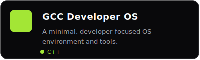
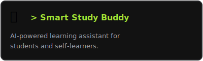
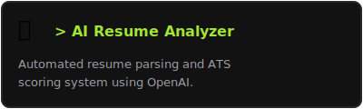
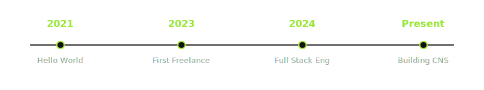
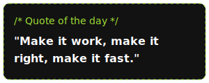

  

 

<h3 align="left"><code>## TECH STACK</code></h3>

  

 

<h3 align="left"><code>## FEATURED PROJECTS</code></h3>

<table width="100%" style="border: none; background: transparent; ">
  <tr style="border: none;">
    <td width="50%" align="center" style="border: none;">
      
    </td>
    <td width="50%" align="center" style="border: none;">
      
    </td>
  </tr>
  <tr style="border: none;">
    <td width="50%" align="center" style="border: none;">
      
    </td>
    <td width="50%" align="center" style="border: none;">
      
    </td>
  </tr>
</table>

 

<h3 align="left"><code>## GITHUB STATS</code></h3>

  
  

 

<h3 align="left"><code>## ENGINEERING JOURNEY</code></h3>

  

 

<h3 align="left"><code>## CURRENTLY</code></h3>

<table width="100%" style="border: none; background: #0000;">
  <tr style="border: none;">
    <td width="60%" valign="top" style="border: none; padding-top: 15px;">
      <ul style="list-style-type: none;">
        <li>🔍 <b><code>Building </code></b> CNS v2 - The ultimate personal cloud</li>
        <li>📚 <b><code>Learning </code></b> System Design, AI Engineering, Advanced Go</li>
        <li>⚡ <b><code>Exploring</code></b> WebGL, UI/UX, Motion Design</li>
        <li>🎯 <b><code>Goal     </code></b> Build products that millions of people love</li>
      </ul>
    </td>
    <td width="40%" valign="top" align="center" style="border: none;">
      
    </td>
  </tr>
</table>

 

<h3 align="left"><code>## LET'S CONNECT</code></h3>

I'm always open to collaborate on exciting ideas and projects.

<table style="border: none; background: transparent;">
  <tr style="border: none;">
    <td style="border: none;">🟢 <a href="https://naseerpasha.me">Portfolio</a></td>
    <td style="border: none;">: naseerpasha.me</td>
    <td style="border: none; padding-left: 30px;">🟢 <a href="https://linkedin.com/in/naseer-pasha">LinkedIn</a></td>
    <td style="border: none;">: linkedin.com/in/naseer-pasha</td>
  </tr>
  <tr style="border: none;">
    <td style="border: none;">🟢 <a href="https://github.com/Naseer-047">GitHub</a></td>
    <td style="border: none;">: github.com/Naseer-047</td>
    <td style="border: none; padding-left: 30px;">🟢 <a href="mailto:naseer047@example.com">Email</a></td>
    <td style="border: none;">: naseer047@example.com</td>
  </tr>
</table>

  <code>&gt; Thanks for visiting! Have a great day! 🚀</code>

