  

 

  <picture>
    <source media="(prefers-color-scheme: dark)" srcset="https://raw.githubusercontent.com/Naseer-047/Naseer-047/output/github-contribution-grid-snake-dark.svg">
    <source media="(prefers-color-scheme: light)" srcset="https://raw.githubusercontent.com/Naseer-047/Naseer-047/output/github-contribution-grid-snake.svg">
    
  </picture>

 

  
  
  
  

 

<table>
  <tr>
    <td valign="top" width="50%">
      <h3> About Me</h3>
<pre lang="js">
const naseer = {
  pronouns: "he" | "him",
  location: "Earth",
  
  education: {
    degree: "Computer Science",
    focus: "Software Engineering"
  },
  
  roles: [
    "Full Stack Developer",
    "Open Source Contributor",
    "Problem Solver"
  ],
  
  philosophy: "Make it work, make it right, make it fast."
};
</pre>
    </td>
    <td valign="top" width="50%">
      <h3> GitHub Stats</h3>
      
      
      
    </td>
  </tr>
</table>

 

###  Tech Arsenal

  
<b>Languages</b>

  
  
  
  
  
  
  
  
<b>Frameworks & Tools</b>

  
  
  
  
  
  
  
  
  
  
  
<b>Infrastructure & DB</b>

  
  
  
  
  
  

  
<b>Cyber Security & OS</b>

  
  

 

###  Open Source Journey

  
  
    
  
  

 

###  Analytics &amp; Metrics

  

 

### 🤝 Connect & Collaborate

  
  
  
  

 

### 💭 Random Dev Quote

  

 
---

 

  
    
  

